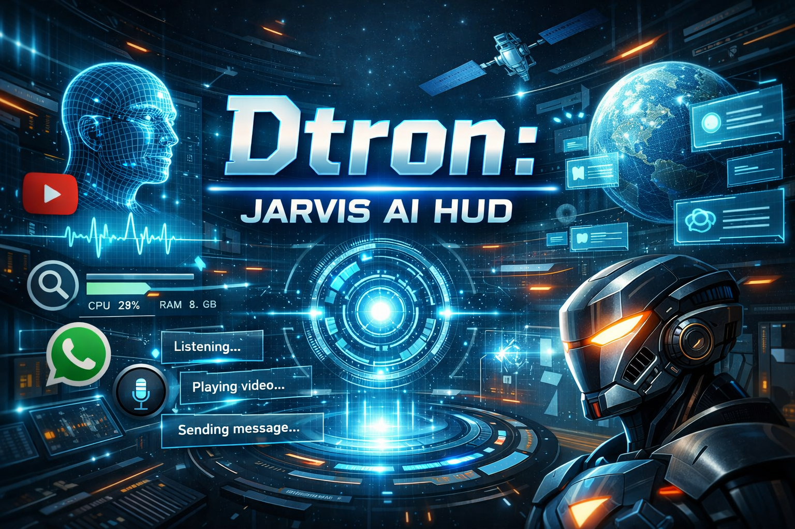

<p align="center">
  
</p>

<h1 align="center">🤖 Dtron </h1>
<p align="center">
  Futuristic AI Assistant with Voice, Vision & Automation
</p>


# 🤖 Dtron

**Dtron** is a next-generation **Jarvis-style AI assistant** featuring a futuristic, high-tech fullscreen HUD (Head-Up Display). It combines voice interaction, multi-agent intelligence, and real-time system monitoring into a seamless, Iron-Man-inspired desktop experience.

Built using **Python + PySide6 + Speech Recognition + LLMs**.

---

## ✨ Features

* 🧠 **LLM-Powered Intelligence:** Advanced reasoning and natural conversation capabilities.
* 🎤 **Voice Interaction:** Hands-free control via SpeechRecognition with spoken feedback (TTS).
* 🖥️ **Futuristic HUD:** Fullscreen, animated Iron-Man–style interface with glowing visuals.
* ✍️ **Dynamic UI:** Typing animations, animated waveforms, and smooth transitions.
* 📊 **System Telemetry:** Live CPU and RAM usage displayed directly on the HUD.
* 📺 **Media & Automation:** YouTube playback and WhatsApp Desktop automation.
* 👁️ **Computer Vision:** Screen reading and visual reasoning powered by AI.
* 🧵 **Robust Architecture:** Thread-safe Qt + multi-threaded AI design for stability.

---

## 🛠 Tech Stack

* **Language:** Python 3.10+
* **GUI Framework:** PySide6 (Qt for Python)
* **Audio:** SpeechRecognition, SoundDevice, pyttsx3
* **Vision & Math:** OpenCV, NumPy
* **System Monitoring:** psutil
* **AI Models:** Local (Ollama) or API-based Large Language Models

---

## 🚀 Installation

### 1️⃣ Clone the Repository

```bash
git clone https://github.com/Deepanshu-choudhary1/Dtron.git
cd Dtron
```

### 2️⃣ Set Up Virtual Environment

```bash
python -m venv venv

# Windows
venv\Scripts\activate

# Linux / macOS
source venv/bin/activate
```

### 3️⃣ Install Dependencies

```bash
pip install -r requirements.txt
```

---

## ▶️ Usage

Launch the JARVIS HUD using the launcher script. This ensures proper initialization of the Qt event loop before activating fullscreen mode.

```bash
python launcher.py
```

### 🎙 Voice Command Examples

* "Open Chrome"
* "Search for Quantum Computing on Google"
* "Play lo-fi music on YouTube"
* "Send a WhatsApp message to Sarah"
* "What is on my screen right now?"
* "Exit system"

---

## 🧠 Architecture Overview

Dtron follows a modular **Agent–Router architecture**:

1. **Voice Input** – Captures speech and converts it to text.
2. **Intent Parser** – Determines user intent using NLP.
3. **Tool Router** – Dispatches tasks to specialized agents (YouTube, Vision, System, etc.).
4. **HUD Output** – Updates the UI and triggers spoken responses.

This separation ensures scalability, clarity, and fault tolerance.

---

## 📂 Repository Structure

| File / Folder   | Description                                                   |
| --------------- | ------------------------------------------------------------- |
| `agents/`       | Specialized agents for AI tasks (voice, vision, apps, tools). |
| `jarvis_hud.py` | Core fullscreen HUD rendering and animation engine.           |
| `launcher.py`   | Application entry point and thread bootstrapper.              |
| `main.py`       | Central orchestration logic connecting agents and UI.         |
| `config.py`     | System configuration, constants, and settings.                |

---

## 📜 License

This project is licensed under the **MIT License** — free to use, modify, and extend.

---

## ⭐ Credits

* **Developer:** Deepanshu Choudhary

---

> 🚀 *Dtron is an experimental AI assistant project built for learning, innovation, and pushing the boundaries of desktop AI interfaces.*
